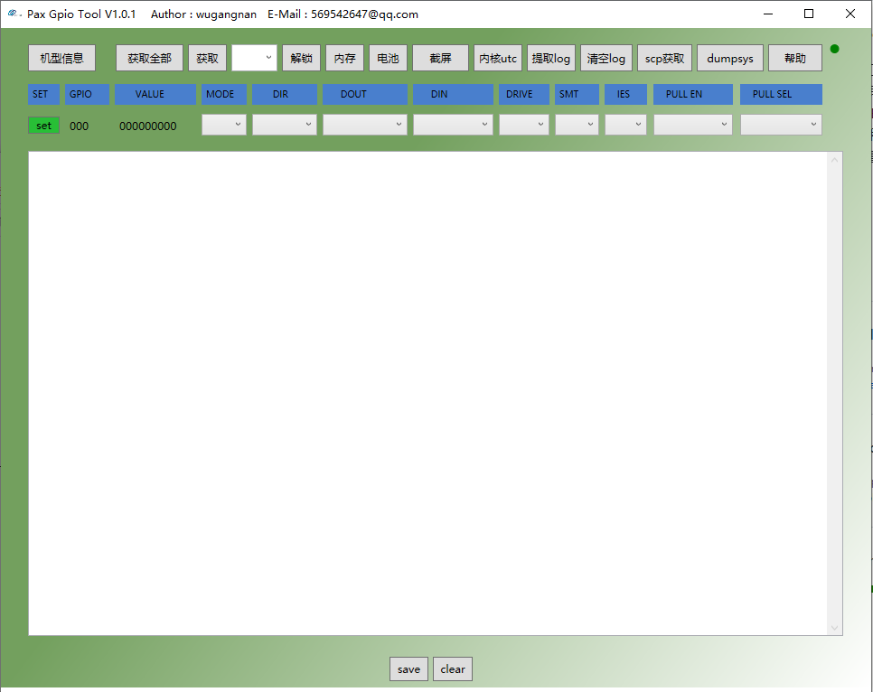

# Pax_Gpio_Tools_V1.0.0
## 界面

---
## 参数说明
### GPIO参数
* [MODE] 当前pin处于的mode
* [DIR] 0：input pin, 1：output pin
* [DOUT] 输出值
* [DIN] 输入值
* [DRIVE] 驱动能力,一般可取值0～7
* [SMT] 使能施密特触发器
* [IES] 输入使能，1：input信号有效 0：input信号无效
* [PULL_EN] 只对input pin有效，使能上/下拉
* [PULL_SEL] 只对input pin有效，1：上拉 0：下拉
* ([R1 R0]) 当前GPIO pin的（上下拉）并联电阻的使能状态
```
1 0表示enable R1，disable R0
0 1表示disable R1，enable R0
1 1表示enable R1， enable R0
```

> 注意：只有部分GPIO支持[R1 R0]并联电阻上下拉功能，且[PULL_EN]必须使能。

### 其他参数说明
* 状态指示灯
当打开软件后系统会检测是否存在adb设备，如果没接手机指示灯为红色，接了后变为绿色。
* 获取IMEI
主要是获取手机IMEI码，成功则显示在下面对话框。
* 获取全部
获取全部GPIO信息。
* PMIC
获取MT6357所有LDO和register信息。
* 内存
获取系统内存使用情况。
* 电池
获取电池主要状态信息和dump register table。
* 截屏
注意：需要将该工具安装到非C盘路径，截图成功后保存在安装目录的Images目录下。
* 提取log
提取MTK DebugLogger生成的log文件，成功后保存在安装目录的debuglogger目录下。
* 自动检测
自动检测平台mt_gpio文件节点路径。
* clear
清屏。
